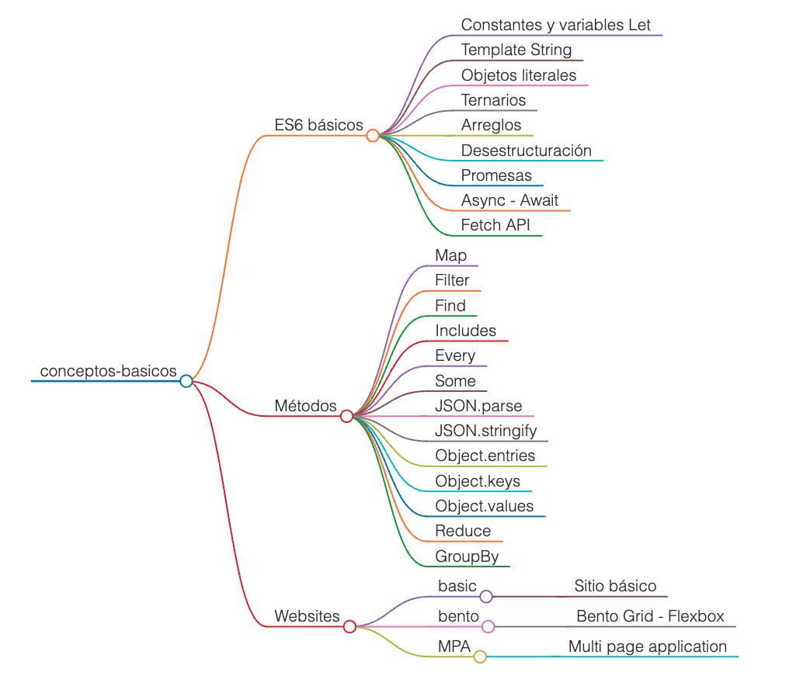

# Roadmap

---

 

> [!important]
>
> - Para correr los script de prueba se ha creado el archivo package.json con scripts personalizados.
> - Acciones:
>   - Ejecución de un script -> **yarn dev < nombre del script >**
>   - Finalizar proceso -> **< ctrl > + c**
>
> .......................................................................

 

---
