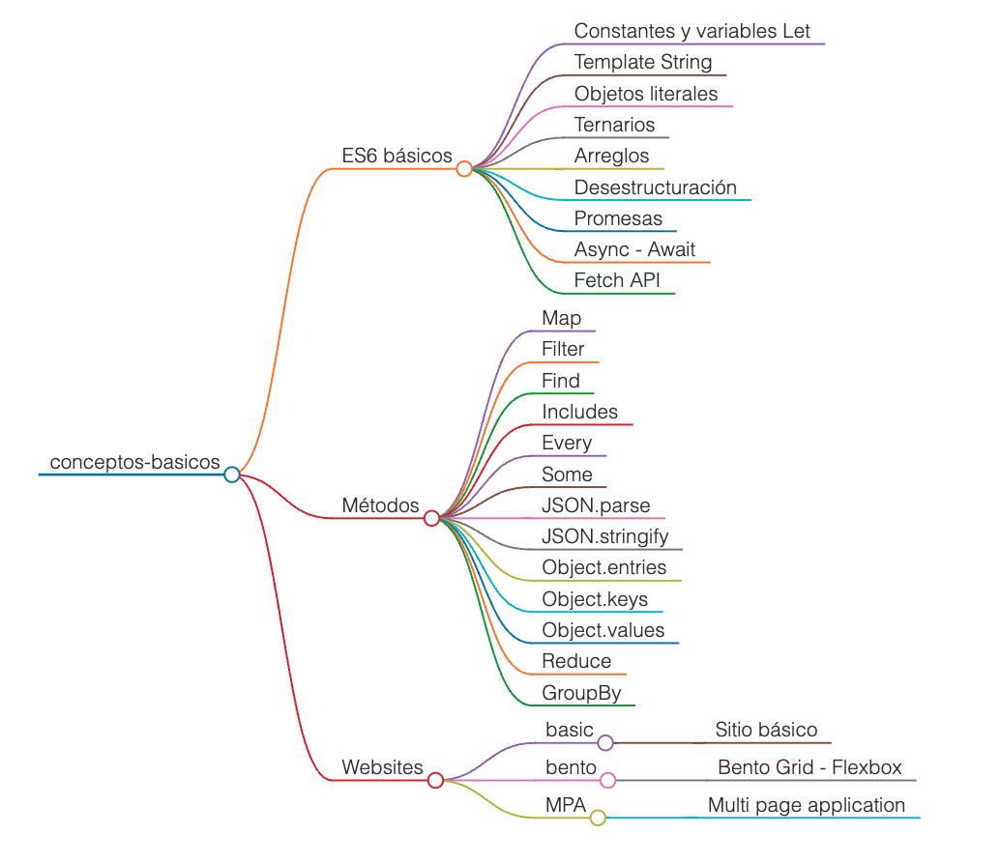
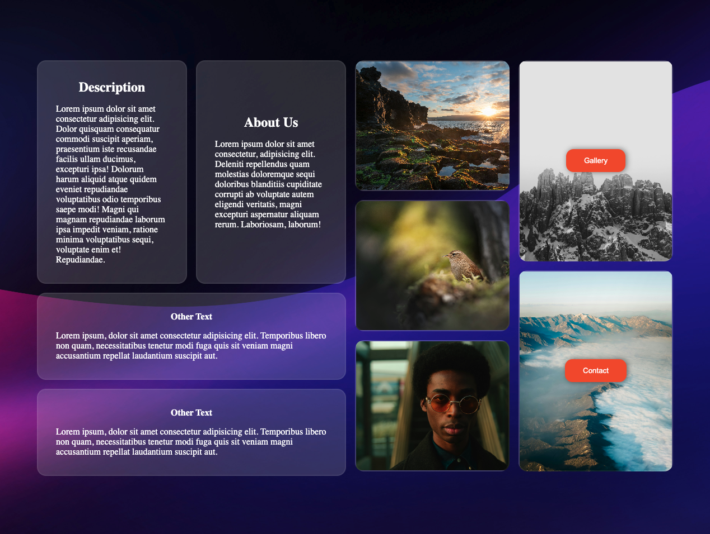
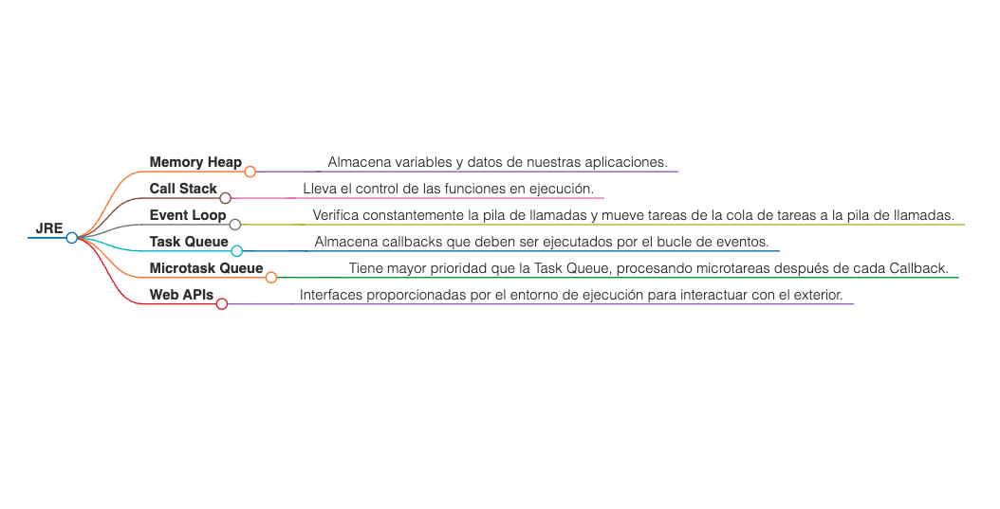
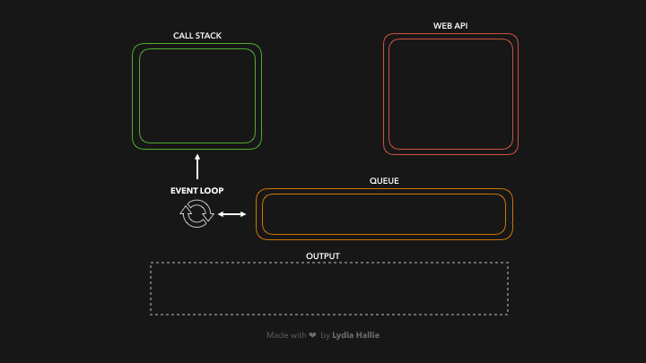

# Roadmap

---

 

> [!important]
>
> - Para correr los script de prueba se ha creado el archivo package.json con scripts personalizados.
> - Acciones:
>   - Ejecución de un script -> **yarn dev < nombre del script >**
>   - Finalizar proceso -> **< ctrl > + c**
>
> .......................................................................

####  Recursos utiles

[33 Concepts Every JavaScript Developer Should Know](https://github.com/leonardomso/33-js-concepts)

 

---

[MPA - Websites](https://reactfrontdevs.github.io/conceptos-basicos/)

 

---

### JRE (JavaScript Runtime Environment)

---

### Event Loop

